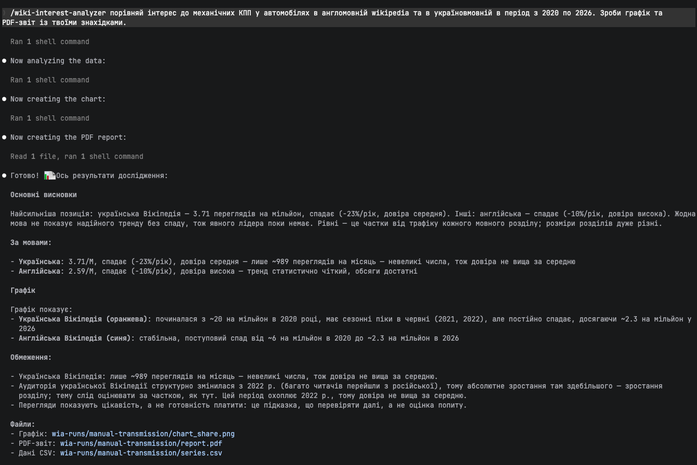
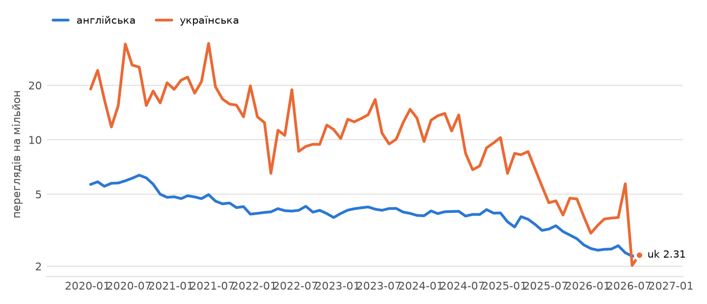

# wiki-interest-analyzer

Agent Skill, що вимірює інтерес до теми в мовних розділах
Вікіпедії за Wikimedia Pageviews: тренд, довіра, графік і PDF-звіт.

Посилання на завдання: [gist](https://gist.github.com/edugenesis/84f332ba58642cf12110b196775a8b72).

## Швидкий старт

Потрібен `uv` - решта встановиться при першому запуску.

Скопіюйте репозиторій і додайте його до навичок агента (на прикладі claude):

```bash
git clone https://github.com/paivazov/wiki-interest-analyzer.git
ln -s "$PWD/wiki-interest-analyzer" ~/.claude/skills/wiki-interest-analyzer
```

Або скачайте архів і додайте його за допомогою Skills -> Add -> Upload skill у веб-версії claude.

Тести: `uv run pytest` (65 тестів).

Agent evals на Haiku 4.5 — 7 сценаріїв, 51 перевірка: 48/51 з навичкою проти 8/23 у тієї ж моделі
без неї ([evals/results.md](evals/results.md)).

## Приклад

Агент на Haiku 4.5 виконує запит:



Згенерований графік — частка теми в трафіку кожного розділу, переглядів на мільйон:



Повний результат: [PDF-звіт на одну сторінку](readme_examples/report.pdf).

Ще: [SKILL.md](SKILL.md) · [DEVLOG.md](DEVLOG.md) · [ROADMAP.md](ROADMAP.md)
